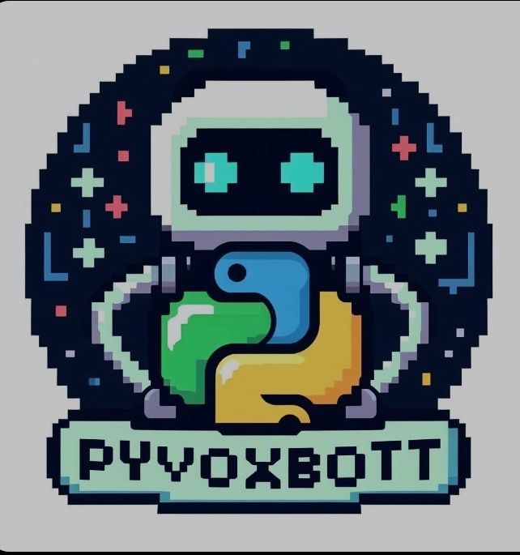

---

# PyVoxBot 2.0 🎙️



## Overview
PyVoxBot 2.0 is a versatile text-to-speech (TTS) tool that brings spoken words to life across different platforms. Whether you're on iOS, Windows, or Android, PyVoxBot has you covered! 🌟

## Features
- **Cross-Platform Magic**: Seamlessly switch between devices without missing a beat.
- **Fun and Functional**: From greetings to farewells, PyVoxBot adds a touch of whimsy to your day.
- **Easy Setup**: Just run the script and let PyVoxBot do the talking! 🚀

## Usage
1. Choose your operating system:
   - Press **1** for macOS (PyVoxBot will greet you with a friendly voice).
   - Press **2** for Windows (PyVoxBot channels its inner PowerShell wizardry).
   - Press **3** for Android (PyVoxBot collaborates with the QPython 3L app).
2. Enter your text.
3. Hear PyVoxBot weave its enchantment! 🔊

## Installation
1. Clone this repository:
   ```bash
   git clone https://github.com/Sufiyan Ahmed4566/PyVoxBot.git
   cd PyVoxBot
   ```
2. Set up the necessary dependencies for your platform (see instructions in the relevant section above).

## Contributing
Contributions are welcome! If you have ideas for improvements or new features, feel free to open an issue or submit a pull request.

## License
This project is licensed under the MIT License - see the [LICENSE](LICENSE) file for details.

---

Feel free to replace the placeholders (such as logo URL) with actual content specific to your project. Happy coding! 😊🔗
